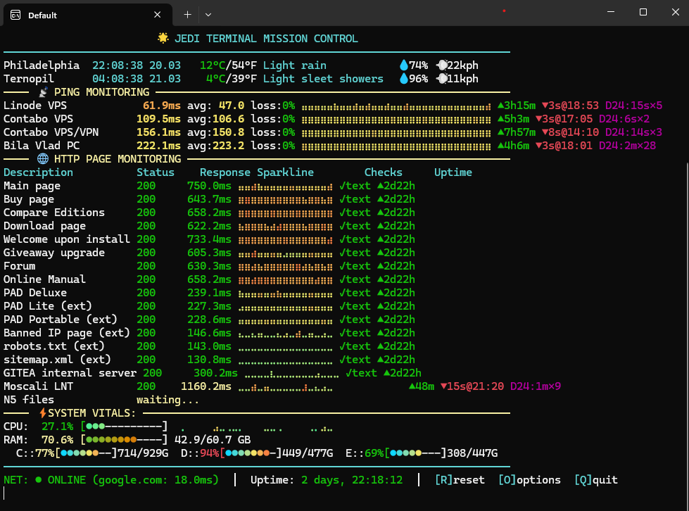

# ⚡ Jedi DevOps Uptime Monitor Plus

> **One Python file. Zero infrastructure. Live terminal dashboard for your servers.**

A lightweight uptime monitor and server health dashboard for the terminal —
no Docker, no Grafana, no Prometheus, no SaaS subscriptions required.
Just drop a `.py` file on any machine, edit a JSON config, and you have a
live monitoring dashboard in under a minute.




---

## Why this exists

Every time I spun up a new VPS, setting up a proper monitoring stack felt like
overkill for the core question: *"Is my site up, and is it fast?"*

Uptime Kuma needs Docker. Prometheus + Grafana needs a dedicated server.
Most SaaS monitoring tools cost money and send your data somewhere else.

This script answers that question from a single terminal window, on any machine,
in 60 seconds flat. Added Star Wars flavor because life's too short for boring
DevOps tools. 🌟

---

## Features

| | |
|---|---|
| 🏓 **ICMP ping monitoring** | Real-time latency tracking for any number of hosts |
| 🌐 **HTTP/HTTPS endpoint checks** | Verifies status code + expected text present + error text absent |
| ⚡ **Adaptive polling** | Speeds up checks on failures, backs off when stable |
| 📊 **CPU / RAM / Disk gauges** | Gradient color meters + Braille Unicode history graphs |
| 🌤️ **Multi-location weather & clock** | Via wttr.in — no API key needed |
| 📈 **Uptime tracking** | Percentage, last failure time, downtime duration |
| 🔔 **Alert notifications** | Telegram bot, e-mail (SMTP), or generic Webhook |
| 🔐 **Credential encryption** | Hardware-bound (disk serial → Fernet key) — config file is safe to back up |
| 📝 **Rotating log files** | Daily monitor log + separate errors-only log |
| ⌨️ **Keyboard shortcuts** | `R` reset stats · `O` options · `Q` quit |
| 🖥️ **Cross-platform** | Windows, Linux, macOS, WSL |
| 📦 **Minimal dependencies** | stdlib + 5 small pip packages, auto-installs on first run |

---

## Quick start

```bash
# 1. Clone or download the single script
git clone https://github.com/Frytskyy/Jedi-DevOps-Uptime-Monitor-Plus.git
cd Jedi-DevOps-Uptime-Monitor-Plus

# 2. Install dependencies
pip install colorama psutil requests pytz cryptography

# 3. Run
python3 uptime_monitor_for_devops.py
```

On first run, a default config `monitor_cld_config.json` is created next to the
script with working demo targets (Google, GitHub, httpbin.org, Wikipedia…).
Edit it to add your own servers, then restart.

> **Python 3.8+** required. No virtual environment needed.

---

## Configuration

All settings live in `monitor_cld_config.json` (auto-created on first run).

### Ping targets
```json
"ping_targets": [
    {"address": "8.8.8.8",        "description": "Google DNS"},
    {"address": "192.168.1.1",    "description": "Router"},
    {"address": "my-vps.example.com", "description": "My VPS"}
]
```

### HTTP endpoint monitoring
```json
"http_targets": [
    {
        "url": "https://mysite.com/",
        "description": "Main site",
        "interval": 60,
        "text_present": ["Welcome", "Copyright 2026"],
        "text_absent":  ["Fatal error", "503"]
    },
    {
        "url": "https://mysite.com/api/health",
        "description": "API health",
        "interval": 30,
        "text_present": ["\"status\":\"ok\""],
        "text_absent":  ["error"]
    }
]
```

`text_present` — strings that **must** appear in the response body (all of them).
`text_absent` — strings that **must not** appear (PHP errors, stack traces, etc).
Global `text_absent` patterns (common PHP/Python/SQL errors) apply to all targets automatically.

### Locations & weather
```json
"locations": [
    {"name": "New York",   "timezone": "America/New_York",    "weather_query": "New York,NY,USA"},
    {"name": "Sunnyvale",  "timezone": "America/Los_Angeles", "weather_query": "Sunnyvale,CA,USA"},
    {"name": "London",     "timezone": "Europe/London",       "weather_query": "London,UK"}
]
```

### Alert notifications
```json
"notifications": {
    "telegram": {
        "enabled": true,
        "bot_token": "YOUR_BOT_TOKEN",
        "chat_id":   "YOUR_CHAT_ID",
        "on_first_failure": true,
        "on_recovery":      true
    },
    "email": {
        "enabled": true,
        "smtp_host": "smtp.gmail.com",
        "smtp_port": 587,
        "smtp_username": "you@gmail.com",
        "smtp_password": "your_app_password",
        "to_addresses": ["admin@example.com"]
    }
}
```

Credentials are **encrypted on disk** using your drive's serial number as key material —
so backing up or sharing the config file does not expose your tokens or passwords.

### Key config options

| Option | Default | Description |
|--------|---------|-------------|
| `ping_interval` | `3` | Seconds between ping sweeps |
| `display_refresh` | `2` | Screen redraw interval (seconds) |
| `ping_failure_threshold` | `5` | Consecutive failures before alert beep |
| `http_failure_threshold` | `2` | Consecutive HTTP failures before alert |
| `beep_on_failure` | `true` | Audible alert on failure |
| `log_response_times` | `false` | Log slow HTTP responses to file |
| `log_slow_threshold_ms` | `1000` | "Slow" threshold in milliseconds |
| `debug_mode` | `false` | Verbose logging |

---

## Running as a background service

### Linux — nohup (quick & dirty)
```bash
nohup python3 uptime_monitor_for_devops.py &> monitor.log &
```

### Linux — systemd (proper, auto-start on boot)
```ini
# /etc/systemd/system/uptime-monitor.service
[Unit]
Description=Jedi DevOps Uptime Monitor Plus
After=network.target

[Service]
ExecStart=/usr/bin/python3 /opt/uptime-monitor/uptime_monitor_for_devops.py
Restart=always
User=youruser
WorkingDirectory=/opt/uptime-monitor

[Install]
WantedBy=multi-user.target
```
```bash
sudo systemctl enable --now uptime-monitor
```

### Windows — run in Windows Terminal on startup
Add a shortcut to `shell:startup` pointing to:
```
python3 "C:\path\to\uptime_monitor_for_devops.py"
```

---

## Platform notes

| Platform | Notes |
|----------|-------|
| **Linux** | Full support. ICMP ping uses raw sockets — run as root, or the script falls back to the system `ping` binary. |
| **macOS** | Full support. Same ICMP note as Linux. |
| **Windows** | Works in Windows Terminal or ConEmu. Classic `cmd.exe` doesn't support 24-bit color — plain ANSI colors instead. |
| **WSL** | Fully supported; same notes as Linux. |

---

## vs. other tools

| Tool | Setup | Cost | Needs server | This script |
|------|-------|------|--------------|-------------|
| Uptime Kuma | Docker required | Free | Yes | ❌ |
| Prometheus + Grafana | Complex stack | Free | Yes | ❌ |
| Datadog / New Relic | Agent install | $$$  | SaaS | ❌ |
| UptimeRobot | Account signup | Freemium | SaaS | ❌ |
| **Jedi DevOps Uptime Monitor Plus** | **One .py file** | **Free** | **No** | **✅** |

This is not a replacement for full-scale monitoring. It's the tool you reach for
when you want an answer in 60 seconds, not after 60 minutes of stack setup.

---

## License

MIT License with Attribution Requirement.

Copyright © 2026 [Volodymyr Frytskyy (WhitemanV)](https://www.vladonai.com/about-resume)

Free to use, modify, and distribute — attribution to the original author required.
See the [full license text](uptime_monitor_for_devops.py) in the script header.

---

## Author

**Volodymyr Frytskyy** — indie developer, self-hoster, reluctant DevOps practitioner.

- 🌐 [vladonai.com](https://www.vladonai.com/about-resume)
- 💾 [AllMyNotes Organizer](https://www.vladonai.com) — the project this monitor was originally built to watch

*May the uptime be with you.* 🌟
